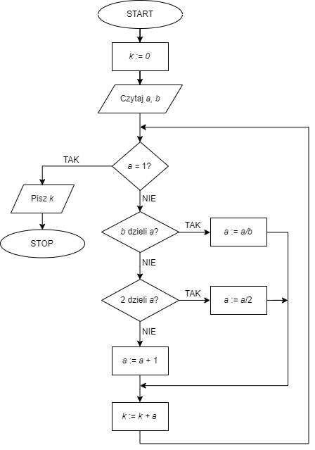

# Zadanie 3: Kodowanie Schematu Blokowego
###### Problem code: SCHEMSPR1 \| Time: 1.00 s \| Memory: 32 MB \| Solved: yes \| print

Zadanie
Zaimplementuj dany schemat w blokowy w Maszynie RAM


#### Przykład
Dla danych wejściowych

```
19 4
```
poprawną odpowiedzią jest
```
39
```
