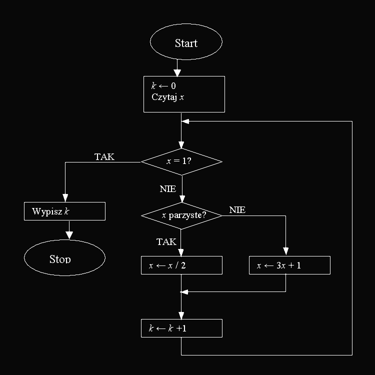

# Kodowanie Schematu Blokowego
###### Problem code: SPRAWDZIAN3 \| Time: 1.00 s \| Memory: 8 MB \| Solved: yes \| print

Zapisz w języku maszyny RAM algorytm opisany następującym schematem:


#### Wejście
Na taśmie wejściowej znajduje się jedna liczba naturalna x.
#### Wyjście
Na taśmie wyjściowej ma znaleźć się jedna liczba (zgodna ze specyfikacją zadania).
#### Przykład
Dla danych wejściowych

```
7
```
poprawną odpowiedzią jest
```
16
```
