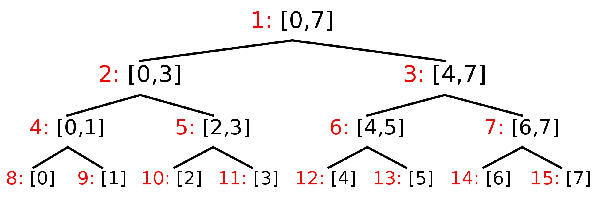

Drzewo przedziałowe - wprowadzenie
Problem code: ITREE_1 | Time: 1.00 s | Memory: 4 MB | Solved: yes | print

Struktura drzewa przedziałowego może być reprezentowana w pamięci komputera jako pełne drzewo binarne, pamiętane w tablicy. Poniższy rysunek przedstawia drzewo przedziałowe dla liczb z przedziału [0,7]

Przy każdym przedziale podano (kolorem czerwonym) jego numer.
W strukturze drzewa przedziałowego, istotne jest to, że każdy przedział [x,y] można rozbić na tzw. przedziały bazowe, tj. takie, które są w wierzchołkach drzewa oraz w sumie dają przedział [x,y]. Oczywiście chodzi o to, aby tych przedziałów było jak najmniej. Tak więc dwa sąsiednie wierzchołki (bracia w drzewie binarnym) nie mogą być jednocześnie przedziałami bazowymi.
Na przykładzie powyższego drzewa, przedział [2,6] zostanie rozbity na [2,3], [4,5], [6,6].

Zadanie
Dla danego rozmiaru drzewa $n$ oraz pewnego przedziału $[x,y]$ należy podać przedziały bazowe, z których się on składa.

Wejście
W pierwszym wierszu dana będą trzy liczby: n, x, y (0 < n ≤ 106, 0 ≤ x ≤ y < n). Możesz założyć, że liczba n będzie potęgą dwójki.

Wyjście
Na wyjściu należy wypisać wszystkie przedziały bazowe, z których składa się przedział [x,y]. Przedziały należy uporządkować po ich początkach. Przed każdym przedziałem należy również podać jego numer w tablicy.

Przykład 1
Dla danych wejściowych

8 2 6
poprawną odpowiedzią jest
5:  [2, 3]
6:  [4, 5]
14: [6, 6]
Przykład 2
Dla danych wejściowych

64 5 40
poprawną odpowiedzią jest
69:  [5, 5]
35:  [6, 7]
9:   [8, 15]
5:   [16, 31]
12:  [32, 39]
104: [40, 40]
