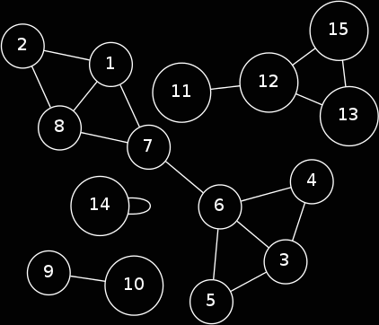

Bombowanie
Problem code: BOMBING | Time: 5.00 s | Memory: 32 MB | Solved: yes | print

Dla Bajtocji nastały złe czasy. Rozliczne grupy terrorystyczne sieją chaos, zamęt i zniszczenie. Jedna z nich planuje właśnie przeprowadzenie zamachu bombowego gdzieś w kraju. Aby zamach odniósł zamierzony skutek, bomba musi zostać umieszczona na takim skrzyżowaniu ulic, żeby po detonacji, która zniszczy skrzyżowanie, przestała istnieć możliwość przejazdu między przynajmniej jedną parą skrzyżowań (inaczej mieszkańcy mogliby w ogóle nie zauważyć, że atak miał miejsce). Pomóż terrorystom (uwaga: to jest tylko zadanie, nie próbuj robić tego naprawdę)! Dla danej mapy połączeń drogowych w Bajtocji wyznacz skrzyżowania, na których mogą oni chcieć umieścić bombę.

Wejście
Na wejściu w pierwszej linii dane są liczby n, m (1 ≤ n ≤ 100 000; 1 ≤ m ≤ 1 000 000) oznaczające odpowiednio ilość skrzyżowań w Bajtocji oraz ilość dróg je łączących. Następnie danych jest m wierszy, z których każdy zawiera dwie liczby a, b (1 ≤ a, b ≤ n) oznaczające, że istnieje droga łącząca skrzyżowania o numerach a oraz b.

Wyjście
Należy wypisać ilość skrzyżowań, które mogą interesować terrorystów oraz ich numery w porządku rosnącym.

Przykład

Dla danych wejściowych

15 17
1 7
1 8
1 2
2 8
3 4
3 5
3 6
4 6
5 6
6 7
7 8
9 10
11 12
12 13
12 15
13 15
14 14
poprawną odpowiedzią jest
3
6 7 12 

