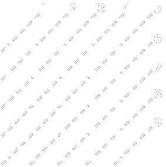

# Najcięższa lewoskośna przekątna
###### Problem code: CTABLES2D5 \| Time: 1 s \| Memory: 32 MB \| Solved: yes \| print


#### Zadanie
Lewoskośne przekątne kwadratowej macierzy A o rozmiarach n×n ponumerowano analogicznie jak na rysunku obok. Napisz program, który znajduje lewoskośną przekątną o największej sumie elementów.

#### Wejście
W pierwszym wierszu znajdują się liczba naturalna n (nie większa od 1000) oznaczająca rozmiar macierzy A. W każdym z kolejnych n wierszy znajduje się ciąg n liczb całkowitych (z przedziału -10000..10000 - są to elementy kolejnego wiersza macierzy A.

#### Wyjście
W jednym wierszu należy wypisać:

* numer lewoskośnej przekątnej macierzy A, o największej sumie elementów (jeśli jest klika takich numerów, należy wypisać najmniejszy z nich),
* dwukropek,
* kolejne (idąc z góry na dół) elementy tej przekątnej oddzielone pojedynczymi spacjami.

#### Przykład
Dla danych wejściowych
```
4
1 2 3 6
4 5 6 2
9 1 2 3
4 9 1 3
```
poprawną odpowiedzią jest
```
3: 3 5 9
```

